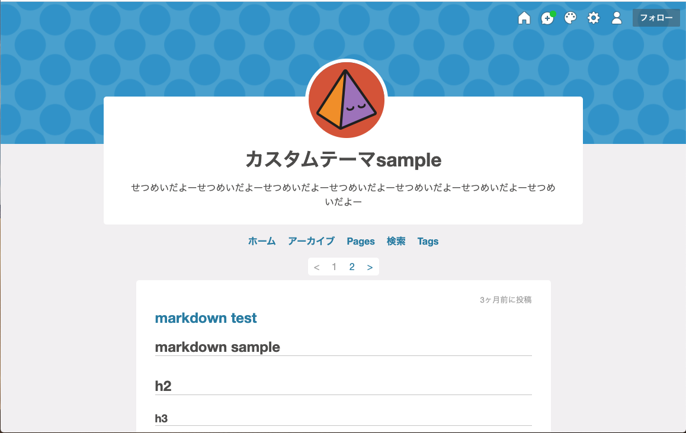
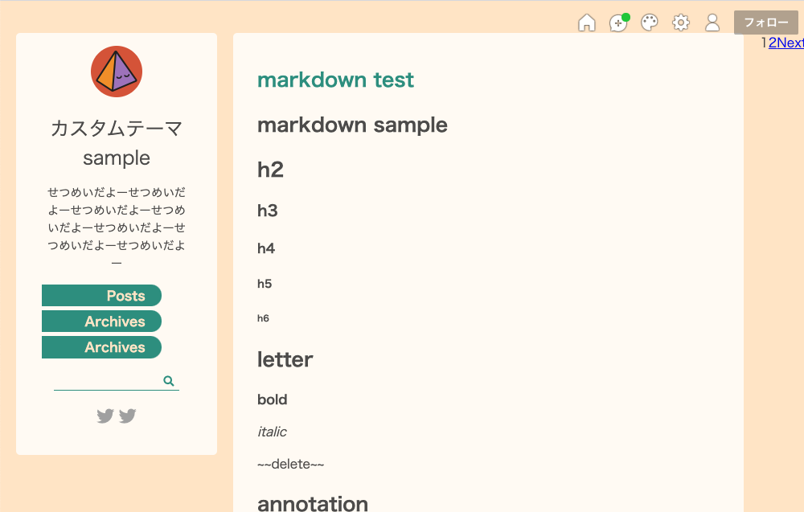
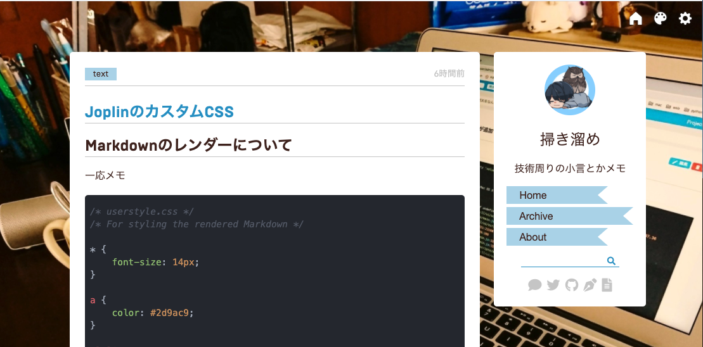
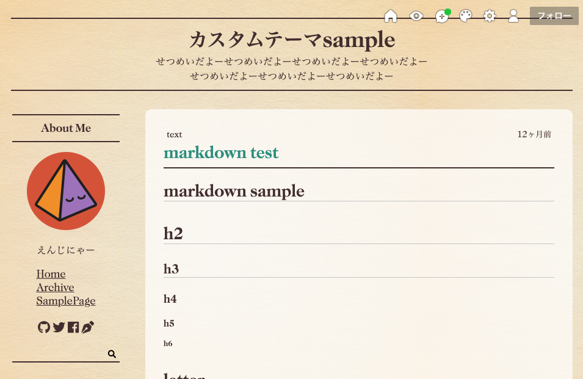

# tumblr-theme

## overview

[tumblr](https://www.tumblr.com/)というミニブログを運営できるサイトにて利用可能なオリジナルのテーマを作成した。

## how to use?

1. tumblrのブログデザインの編集ページに移動する。
1. テーマ選択エリアにある、`HTML編集`をクリックする。
2. `theme`ディレクトリにある、`theme.html`をコピペする。
3. 保存する。

## themes

### theme 1
最初に作ったテーマ。



### theme 2
次に作ったテーマ。ページネーションが死んでいる...( ˘ω˘ )



### theme 3
2020/08/15現在メインで使ってるやつ。Disqusコメント対応。



### theme 4
created at 2021/04/18

新聞をイメージして作ったやつ




## how to develop

`theme*`のディレクトリ構造について。

```
theme*
├── index.html // ローカルでテーマを作るときに使う
├── src
│   ├── css
│   │   └── main.css  // scssのコンパイル後ファイル
│   └── sass
│       └── main.scss  // ローカルでテーマを作るときに使う
└── theme.html // tumblr用の書式を適用したもの。コピペで使える。
```

新しくテーマを作る時は、`gulpfile.js`の`theme`を変更してください。sassのコンパイル時、ディレクトリを指定するのに使用します。

## markdown用のcssの適用
htmlで、`.post-body`ってクラスの下ならば、適用できます。

```
<div class="post-body">
  {Body}
</div>
```